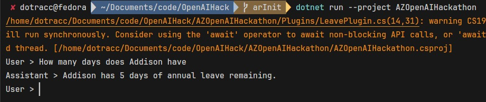

# AZ OpenAI post-hackathon template

This was made after 4.5 hours in FSP's first hackathon. 

This repo shows a brief example on how to use the OpenAI Semantic Kernel package.

## Getting Started

- .Net 6+
- Add endpoint & apiKey from Azure Open AI GPT 4
- Run the project

### Build
```bash
dotnet run --project AZOpenAIHackathon
```



### Extension
To extend this add code in ./Plugins/LeavePlugin.cs.

## References
https://learn.microsoft.com/en-us/semantic-kernel/overview/?tabs=Csharp
https://azure.microsoft.com/en-gb/products/ai-services/openai-service/

